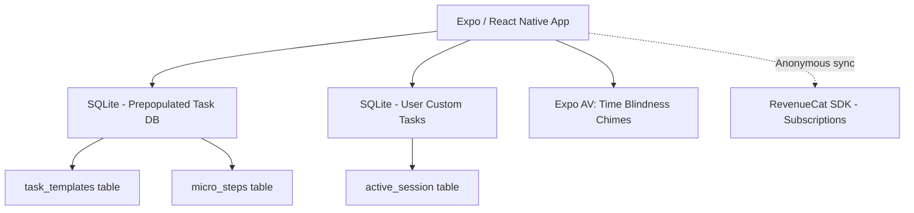

# HyperFocus Architecture

**Document:** ARCHITECTURE.md  
**Product:** HyperFocus (ADHD Paralysis Breaker)  
**Publisher:** Heldig Lab  
**Price:** Free (Manual Mode) / $14.99 Paid Upfront (Paralysis Breaker DB + Audio). No Subscriptions.  
**Source of Truth:** [SPEC.md](./SPEC.md)  

## Purpose

This document defines the architecture for HyperFocus. It covers:
- Expo / React Native app structure
- The Local Micro-Step Engine (Paralysis Breaker)
- Background Audio for Time Blindness
- The Zero-Backend Reality

## Architectural Principles & Competitive Edge

- **Strictly No Backend:** ADHD users value privacy. No to-do items or behavioral data leaves the device. The 300+ "overwhelming task" breakdowns are shipped within the app bundle as a SQLite database.
- **Deterministic Logic:** We do not use LLMs to break down tasks. We use a curated, hardcoded taxonomy of micro-steps to ensure high-quality, empathetic, non-robotic advice.
- **One Price Forever:** RevenueCat is used strictly for on-device receipt validation of a non-consumable $14.99 purchase. No "ADHD Tax" recurring billing.

## System Context



## High-Level Component Model

### Client Layer

- **Zustand:** Global state for the active "One Thing Mode" session, the visual timer state, and the current micro-step index.
- **SQLite (expo-sqlite):** 
  - DB 1: Read-only `templates.db` shipped in assets.
  - DB 2: Read/Write `user_data.db` created on launch.
- **Expo AV:** Manages the background audio loop that speaks or chimes the time every X minutes (to combat time blindness).

### The "No Backend" Reality
- We do not use OpenAI or Anthropic to generate task breakdowns. The breakdowns are pre-written by humans and bundled in the app to guarantee immediate <50ms load times and 100% offline functionality.

## Data Model (SQLite)

Two database files:
- **`templates.db`** (read-only, shipped in app assets) -- pre-populated seed data with 300+ task breakdowns.
- **`user_data.db`** (read/write, created on first launch) -- user progress and settings.

### SQLite Schema

```sql
-- ═══════════════════════════════════════════════════════
-- templates.db  (read-only, bundled in app assets)
-- ═══════════════════════════════════════════════════════

-- Curated library of overwhelming tasks broken into micro-steps
CREATE TABLE task_templates (
    id                INTEGER PRIMARY KEY AUTOINCREMENT,
    category          TEXT    NOT NULL,                -- e.g. 'Cleaning', 'Admin', 'Self-Care'
    task_name         TEXT    NOT NULL,                -- e.g. "Clean the Kitchen"
    difficulty        TEXT    NOT NULL,                -- 'easy', 'medium', 'hard'
    estimated_minutes INTEGER                         -- total estimated time for all steps
);

-- Ordered micro-steps belonging to a template
CREATE TABLE micro_steps (
    id            INTEGER PRIMARY KEY AUTOINCREMENT,
    template_id   INTEGER NOT NULL REFERENCES task_templates(id),
    step_number   INTEGER NOT NULL,                   -- 1-based display order
    instruction   TEXT    NOT NULL                    -- e.g. "Grab a trash bag."
);

-- ═══════════════════════════════════════════════════════
-- user_data.db  (read/write, created on first launch)
-- ═══════════════════════════════════════════════════════

-- Tasks the user has started (from a template or custom)
CREATE TABLE user_tasks (
    id            INTEGER PRIMARY KEY AUTOINCREMENT,
    template_id   INTEGER,                            -- NULL for fully custom tasks
    custom_name   TEXT,                               -- user-provided name if custom
    status        TEXT    NOT NULL DEFAULT 'active'
                  CHECK(status IN ('active','completed','abandoned')),
    started_at    TEXT    NOT NULL DEFAULT (datetime('now')),
    completed_at  TEXT                                -- set when status changes
);

-- Per-step completion tracking for a user task
CREATE TABLE user_step_progress (
    id            INTEGER PRIMARY KEY AUTOINCREMENT,
    user_task_id  INTEGER NOT NULL REFERENCES user_tasks(id) ON DELETE CASCADE,
    step_number   INTEGER NOT NULL,                   -- matches micro_steps.step_number
    completed_at  TEXT    NOT NULL DEFAULT (datetime('now'))
);

-- App-wide key/value settings (chime interval, theme, etc.)
CREATE TABLE settings (
    key   TEXT PRIMARY KEY,
    value TEXT
);

-- Indexes for quick lookups
CREATE INDEX idx_micro_steps_template_id       ON micro_steps(template_id);
CREATE INDEX idx_user_tasks_status             ON user_tasks(status);
CREATE INDEX idx_user_step_progress_task_id    ON user_step_progress(user_task_id);
```

### RevenueCat Integration

**SDK:** `react-native-purchases` (RevenueCat React Native SDK)
**Authentication:** Anonymous App User IDs (no account creation required)

#### Product Configuration

| Platform | Product ID | Type | Price |
|----------|-----------|------|-------|
| iOS | `hyperfocus_premium` | Non-Consumable | $14.99 |
| Android | `hyperfocus_premium` | Non-Consumable | $14.99 |

#### Entitlements

| Entitlement | Grants Access To |
|------------|-----------------|
| `premium` | Paralysis Breaker database (300+ pre-broken-down overwhelming tasks across cleaning, organizing, packing, self-care), Time Blindness Audios (spoken voice announcing the time every 10 minutes) |

#### Implementation Flow

1. **App Launch:** Initialize RevenueCat SDK with anonymous user ID. Check entitlement status from cache.
2. **Paywall Display:** Show paywall when user hits free-tier limit. Fetch offerings from RevenueCat (falls back to cached offerings if offline).
3. **Purchase:** Call `purchasePackage()`. RevenueCat handles receipt validation with Apple/Google servers.
4. **Verification:** On success, RevenueCat updates entitlement. App checks `customerInfo.entitlements.active['premium']`.
5. **Restore:** "Restore Purchases" button calls `restorePurchases()`. Essential for users reinstalling or switching devices.
6. **Offline Fallback:** RevenueCat caches entitlement status locally. Premium access persists offline after initial verification. Cache TTL: 25 hours (RevenueCat default). If cache expires while offline, maintain last-known premium status until next successful server check.

#### Error Handling

- **Purchase cancelled:** No action. Return to paywall.
- **Purchase failed:** Show "Purchase couldn't be completed. Please try again." Do not retry automatically.
- **Network error during restore:** Show "Couldn't reach the App Store. Check your connection and try again."
- **Receipt validation failed:** Log error. Show generic "Something went wrong" message. Do not grant premium.

## The Generation Engine
If a user searches for "Laundry", the local engine queries `task_templates` using `LIKE '%laundry%'`. If matched, it pulls the `micro_steps` array.
If the user types a completely custom task like "Write TPS Report", the app falls back to a generic template:
1. "Open the tools you need."
2. "Do the absolute smallest first step."
3. "Set a 5-minute timer and just start."